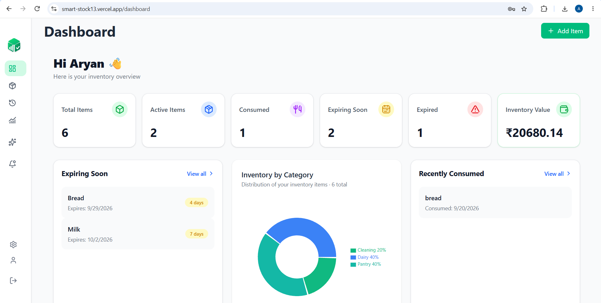
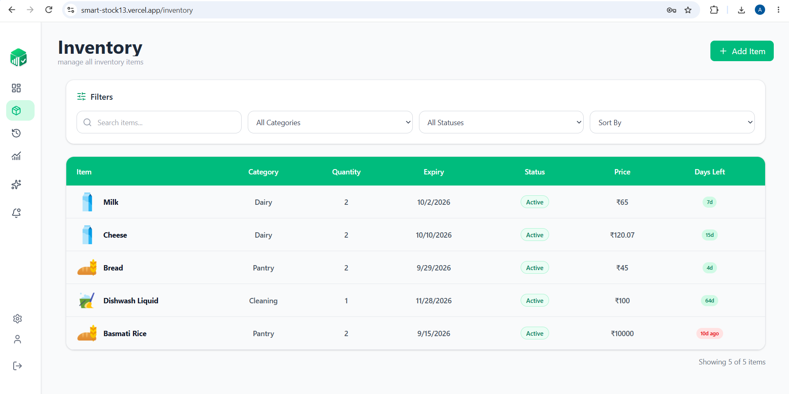
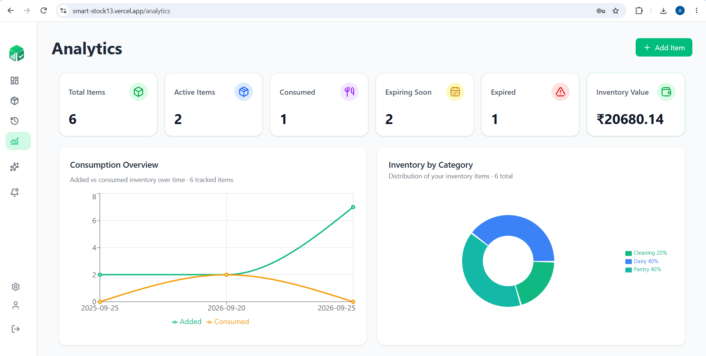
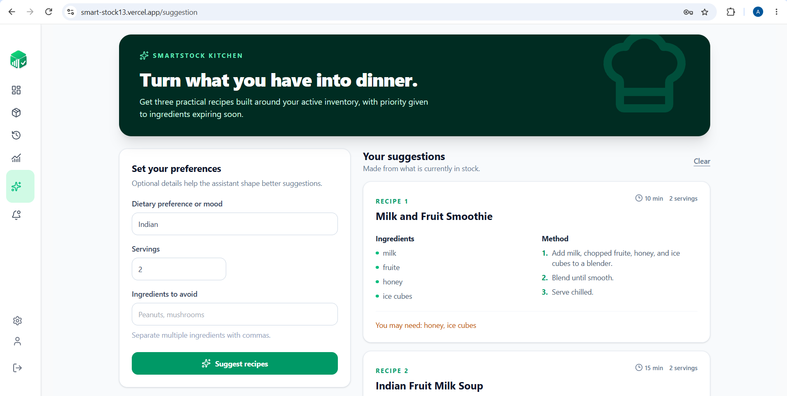

<div align="center">

# 🧺 SmartStock

### Smart Personal Inventory & Expiry Management

Track your inventory, monitor expiry dates, analyze consumption, and get AI-powered recipe suggestions using the items you already own.

> 🚀 **Status:** Active Development

[](https://react.dev/)
[](https://vite.dev/)
[](https://nodejs.org/)
[](https://expressjs.com/)
[](https://www.mongodb.com/)
[](https://tailwindcss.com/)

<br />

<a href="#-screenshots">Screenshots</a> •
<a href="#-features">Features</a> •
<a href="#-architecture">Architecture</a> •
<a href="#-getting-started">Getting Started</a> •
<a href="#-roadmap">Roadmap</a>

</div>

<br />

**Track what you own. Know what expires. Use it before it goes to waste.**

🔗 **Live Demo:** [smart-stock13.vercel.app](https://smart-stock13.vercel.app)

---

## 📖 Overview

SmartStock is a full-stack personal inventory management platform that helps users track items, monitor expiry dates, analyze inventory, manage notifications, and generate AI-powered recipes using available ingredients.

Keeping track of household inventory by memory, notebooks, or spreadsheets is tedious and error-prone. SmartStock replaces that with a single dashboard that shows stock levels, expiry status, inventory value, and consumption trends at a glance — and even suggests what to cook with what you already have.

## 📸 Screenshots

<!-- Add screenshots to a /screenshots folder and update the paths below -->

### Dashboard


### Inventory


### Analytics


### AI Recipe Suggestions


## ✨ Features

### 🔐 Authentication
- User registration and login
- JWT-based authentication
- Password hashing with bcrypt
- Protected API routes

### 📦 Inventory Management
- Add, edit, and delete inventory items
- Track quantity and price
- Store purchase and expiry dates
- Add notes to inventory items

### 🔎 Search, Filter & Sort
- Search inventory by name
- Filter by category
- Filter by inventory status
- Sort by expiry date or alphabetically

### 📊 Dashboard
- Total inventory items
- Fresh, consumed, expiring, and expired counts
- Total inventory value

### ⏰ Expiry Tracking
- Monitor upcoming expiry dates
- Identify expired items
- Highlight items expiring soon
- Track consumed inventory

### 🔔 Notifications
- Inventory creation notifications
- Consumption notifications
- Expiry and expiration alerts
- Persistent notification history

### 📈 Analytics
- Inventory statistics and category distribution
- Inventory value insights
- Visual charts and graphs

### 🤖 AI Recipe Suggestions
- Generate recipes using available inventory
- Consider user preferences and serving size
- Identify missing ingredients
- Show which inventory items are being used

### 📱 Responsive UI
- Works across desktop, tablet, and mobile

## 🤖 AI-Powered Recipe Suggestions

SmartStock can generate recipe suggestions based on the user's available inventory. The system sends the available inventory items to the backend, where an AI model generates a recipe while considering:

- Available ingredients
- User preferences
- Number of servings
- Missing ingredients

Example response:

```json
{
  "name": "Vegetable Rice",
  "ingredients": [],
  "steps": [],
  "prepTime": "25 minutes",
  "servings": 2,
  "usesInventory": true,
  "missingIngredients": []
}
```

The AI API key is kept securely on the backend and is never exposed to the frontend.

## 🛠️ Tech Stack

### Frontend
- React.js + React Router
- Vite
- Tailwind CSS
- Axios
- Context API
- Recharts
- Lucide React

### Backend
- Node.js + Express.js
- MongoDB + Mongoose
- JWT authentication
- bcrypt for password hashing
- CORS, dotenv

### AI
- Groq API
- AI-powered recipe generation

### Deployment
- Vercel — Frontend
- Render — Backend
- MongoDB Atlas — Database

## 🏗️ Architecture

```text
SmartStock
│
├── smartstock/                 # React Frontend
│   ├── components/
│   ├── pages/
│   ├── services/
│   ├── context/
│   └── ...
│
├── backend/                    # Node + Express Backend
│   └── src/
│       ├── controllers/
│       ├── routes/
│       ├── models/
│       ├── middleware/
│       ├── config/
│       └── ...
│
└── README.md
```

### Request Flow

```text
React Frontend
      │
      │ Axios
      ▼
Express REST API
      │
      ├── Authentication
      ├── Inventory
      ├── Dashboard
      ├── Analytics
      ├── Notifications
      └── AI Recipes
      │
      ▼
MongoDB Atlas
```

## 📁 Project Structure

```
SmartStock/
├── backend/          # Express API, routes, controllers, models
├── smartstock/       # React frontend (Vite)
├── screenshots/       # README screenshots
├── .gitignore
└── README.md
```

## 🔌 API Overview

| Module | Endpoint | Method | Description |
|---|---|---|---|
| Auth | `/api/auth/register` | POST | Register user |
| Auth | `/api/auth/login` | POST | Login user |
| Auth | `/api/auth/me` | GET | Get current user |
| Items | `/api/items` | GET | Get inventory |
| Items | `/api/items` | POST | Add inventory item |
| Items | `/api/items/:id` | PUT | Update inventory item |
| Items | `/api/items/:id` | DELETE | Delete inventory item |
| Dashboard | `/api/dashboard` | GET | Dashboard statistics |
| Analytics | `/api/analytics` | GET | Analytics data |
| Notifications | `/api/notifications` | GET | Get notifications |
| Recipes | `/api/recipes/suggest` | POST | Generate AI recipe |

> Adjust the exact endpoints above to match your current backend routes.

## 🚀 Getting Started

### Prerequisites
- Node.js (LTS recommended)
- MongoDB (local instance or MongoDB Atlas)

### 1. Clone the repository

```bash
git clone https://github.com/Aryan1309006/SmartStock.git
cd SmartStock
```

### 2. Backend setup

```bash
cd backend
npm install
```

Create a `.env` file in `backend/`:

```env
PORT=3000
MONGODB_URI=your_mongodb_connection_string
JWT_SECRET=your_secure_jwt_secret
GROQ_API_KEY=your_groq_api_key
```

Start the backend:

```bash
npm start
```

### 3. Frontend setup

```bash
cd ../smartstock
npm install
```

Create a `.env` file in `smartstock/`:

```env
VITE_API_URL=http://localhost:3000/api
```

Start the frontend:

```bash
npm run dev
```

The frontend will start on Vite's default port (typically `http://localhost:5173`) and will talk to the backend API.

> Never commit `.env` files or API keys to GitHub.

## 🔐 Environment Variables

### Backend

| Variable | Description |
|---|---|
| `PORT` | Backend server port |
| `MONGODB_URI` | MongoDB connection string |
| `JWT_SECRET` | Secret used to sign JWT tokens |
| `GROQ_API_KEY` | API key for AI recipe generation |

### Frontend

| Variable | Description |
|---|---|
| `VITE_API_URL` | Backend API base URL |

## 🌐 Deployment

### Frontend
The React frontend is deployed using Vercel.

Live application: [smart-stock13.vercel.app](https://smart-stock13.vercel.app)

### Backend
The Express API is deployed using Render.

### Database
MongoDB Atlas is used as the production database.

The frontend communicates with the backend through the configured `VITE_API_URL` environment variable.

## 🔄 How SmartStock Works

1. Create an account or log in.
2. Add inventory items with quantity, price, and expiry date.
3. Monitor inventory from the dashboard.
4. Search, filter, and sort items.
5. Track upcoming and expired items.
6. View inventory analytics.
7. Receive inventory notifications.
8. Generate AI-powered recipes using available ingredients.

## 🧠 Challenges & Solutions

### MongoDB Connection
Handled MongoDB Atlas connection configuration and environment-specific database connectivity.

### CORS
Configured the Express backend to allow requests from the local development frontend and the deployed Vercel frontend.

### Authentication
Implemented JWT-based authentication with protected routes and password hashing using bcrypt.

### AI API Security
Kept the AI API key on the backend instead of exposing it through frontend environment variables.

## 📚 What I Learned

Building SmartStock helped me practice:

- Designing REST APIs with Express
- MongoDB database modeling with Mongoose
- JWT authentication and password hashing
- Connecting React applications to backend APIs
- Managing frontend state with Context API
- Building responsive interfaces with Tailwind CSS
- Creating data visualizations with Recharts
- Handling API errors and loading states
- Deploying full-stack applications
- Managing environment variables securely
- Integrating AI APIs securely
- Configuring CORS between frontend and backend

## 📦 Example Item

```json
{
  "name": "Milk",
  "category": "Dairy",
  "purchaseDate": "2026-09-01",
  "price": 60,
  "quantity": 2,
  "status": "In Stock",
  "expiryDate": "2026-09-05",
  "notes": "Keep refrigerated"
}
```

## 🔮 Roadmap

- [ ] Email expiry reminders
- [ ] Barcode scanning
- [ ] Receipt scanning
- [ ] Shared household inventory
- [ ] Grocery shopping suggestions
- [ ] Progressive Web App (PWA) support
- [ ] Mobile application
- [ ] More advanced AI inventory insights

## 👨‍💻 Author

**Aryan Patil**
B.E. Information Technology

## 📄 License

This project currently has no license specified. Add a `LICENSE` file if you'd like to open it up for reuse.
